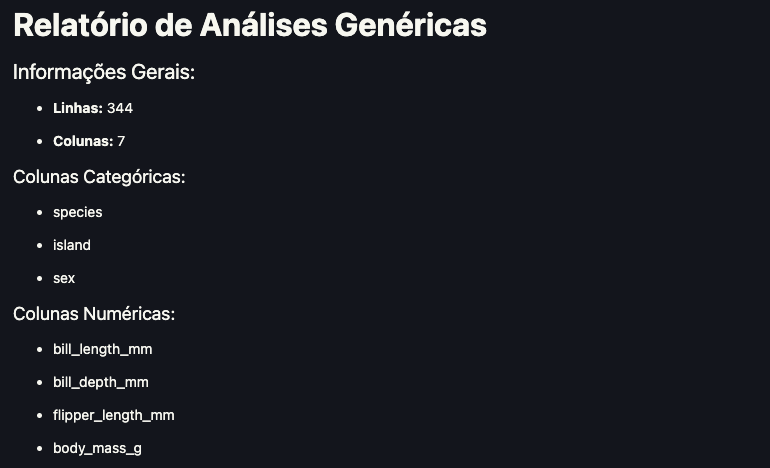
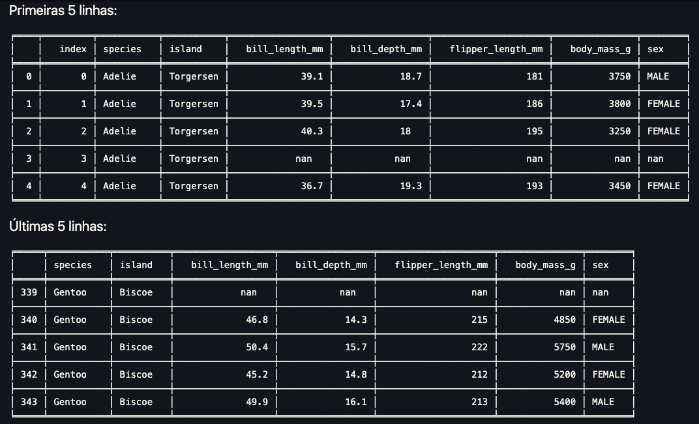

# Projeto de Análise de Dados

## Autores
- [Breno Lima](https://github.com/BrenoLima54/)
- [Fernando Soutto](https://github.com/FeSoutto)
- [Raul Carvalho](https://github.com/raulcrvlh/)

## Proposta do Projeto

O objetivo deste projeto é criar um módulo de **Data Quality** utilizando Programação Orientada a Objetos (POO). Esse módulo, ao ser importado para um Jupyter Notebook, permitirá a criação de relatórios automatizados, semelhantes ao que pandas-profiling, YData-profiling e SweetViz oferecem.

O módulo desenvolvido terá métodos específicos para análise de qualquer dataset, como:

- Contagem de valores nulos
- Contagem de valores únicos
- `.value_counts()` em colunas categóricas
- `.describe()` em colunas numéricas
- Gráficos de distribuição de colunas categóricas e numéricas
- ...

### Objetivo

Utilizando o módulo, realizaremos a análise de um dataset escolhido no Kaggle.

## Métodos Desenvolvidos

Aqui estão os métodos que foram implementados no módulo:

- **`quick_info()`**: Mostra informações gerais sobre o dataset

- **`first_rows()`**: Por padrão, exibe as 5 primeiras linhas do dataset
- **`last_rows()`**: Por padrão, exibe as últimas 5 linhas do dataset

- **`sample_rows()`**: Por padrão, exibe amostra de 5 linhas do dataset
- **`count_nulls()`**: Contagem de dados nulos do dataset
- **`count_unique()`**: Contagem dos valores únicos no dataset

- **`most_common()`**: Exibe os dados mais comuns por coluna
- **`numerical_analyzes()`**: Realiza uma análise das colunas numéricas

- **`categorical_analyzes()`**: Realiza uma análise das colunas categóricas
- **`report()`**: Gera um relatório completo de análise

## Exemplo de Utilização

Para utilizar o módulo, crie um arquivo `.ipynb` e siga as etapas abaixo:

```bash
pip install pandas numpy matplotlib tabulate IPython
```

```python
from dataquality import DataQuality

# Carregar o dataset
df = DataQuality("datasets/nome_do_seu_dataset.csv")

# Gerar o relatório
df.report()
